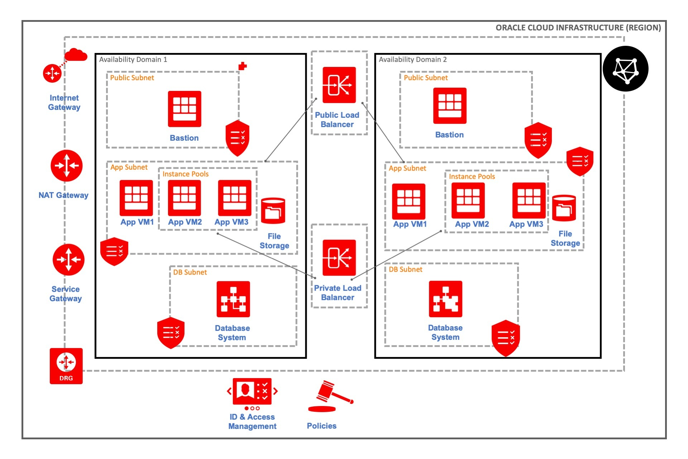

# ebs_on_oci

A web-based application which enables the end user to provision a network architecture on Oracle Cloud Infrastructure with a few clicks. The provisioned network and compute resources can be used by teams to deploy and run E-Business Suite on OCI.

Let's take a look at the use case for this demo. The application is built to support an end user who is interested in provisioning a network architecture on OCI with minimal efforts. He is required to enter the necessary details such as the authentication parameters for the Oracle cloud tenancy & user, desired names for all the OCI resources, CIDR blocks for VCN and subnets through the application front end.

All the details are stored in terraform file as an input and are combined with the configuration files (in the src/backEnd/repo). The terraform configuration files are packaged and sent to Oracle Resource Manager which then executes the stack and provisions resources in the tenancy.

The EBS on OCI Architecture:

